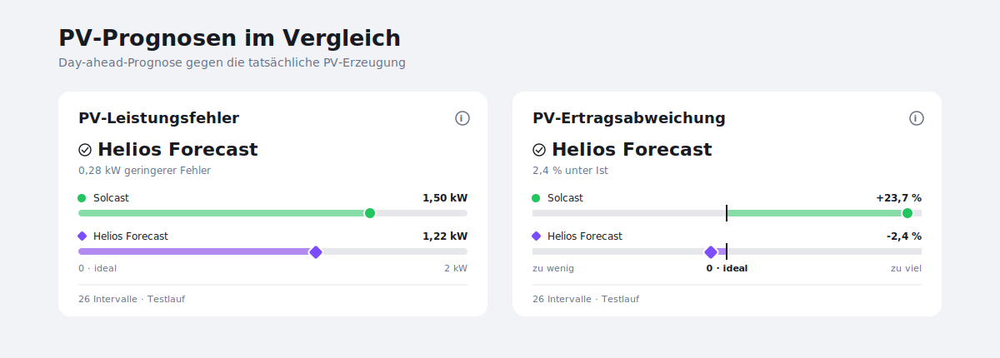

# PV Forecast Quality Card

A Home Assistant custom-card bundle for comparing PV forecasts with actual production. It contains compact quality cards plus ECharts day-profile and long-term cards, all designed for Sections dashboards.



The bundle registers three card types:

- `custom:pv-forecast-quality-card` for understandable quality metrics
- `custom:pv-forecast-day-card` for today's actual power and one or two forecast profiles
- `custom:pv-forecast-history-card` for the last 7–90 complete day-ahead days

The quality card has two independent modes:

- `power`: average distance between forecast and actual power (MAE, in kW)
- `energy`: deviation between forecast and actual yield (in %)

Use two card instances when you want to show both evaluations. Each instance remains a separate Home Assistant card and uses natural, content-based height.

The compact card surface shows only the verdict, provider values, and evaluation status. Metric details are available from the info button as an overlay tooltip on hover, keyboard focus, or tap without changing the card height.

## Important data contract

This is a frontend card. It does **not** freeze forecasts or calculate historical day-ahead quality on its own. Supply entities that already represent a methodologically valid comparison. If a forecast integration updates during the day, freeze the day-ahead forecast in the Home Assistant backend before calculating the metrics.

## Installation with HACS

1. Open HACS.
2. Add `https://github.com/ignazhabibi/pv-forecast-quality-card` as a custom repository in the **Dashboard** category.
3. Download **PV Forecast Quality Card**.
4. Refresh the Home Assistant frontend.

HACS should register the module automatically. If needed, add `/hacsfiles/pv-forecast-quality-card/pv-forecast-quality-card.js` as a JavaScript module under dashboard resources.

## Daily ECharts profile

The day card loads the actual entity's recorder history, averages it into five-minute bins, and converts the configured source unit to kW. Forecast arrays are read directly from entity attributes and linearly interpolated onto the same five-minute timeline.

- Actual production is a solid orange 1.5 px line with a subtle 8% orange area.
- Forecasts are dashed 1.5 px lines in their provider colors.
- Legend and tooltip markers are always round dots.
- The shared tooltip always lists every configured series; unavailable future actual values are shown as `–`.
- The x-axis always spans the complete local day.

```yaml
type: custom:pv-forecast-day-card
title: PV-Leistung heute
actual:
  name: Ist-Leistung
  entity: sensor.wechselrichter_solar_power
  color: "#F59E0B"
  unit: W
forecast_1:
  name: Solcast
  entity: sensor.solcast_pv_forecast_prognose_heute
  color: "#22C55E"
  unit: kW
  attribute: detailedForecast
  datetime_key: period_start
  value_key: pv_estimate
forecast_2:
  name: Helios Forecast
  entity: sensor.aussenbereich_pv_hausdach_power_now
  color: "#7C4DFF"
  unit: W
  attribute: forecast
  datetime_key: datetime
  value_key: watts
grid_options:
  columns: full
  rows: auto
```

Omit `forecast_2` for a single-provider day profile. The chart shows the integrations' currently reported forecasts; the quality cards remain the methodologically correct place to evaluate the frozen day-ahead snapshots.

## Long-term ECharts comparison

The history card reads permanent daily recorder statistics from the backend metric entities. It does not create or alter snapshots. The default yield view uses grouped, diverging bars: above the orange actual reference means too much energy was forecast, below it means too little. The power-profile view uses dashed 1.5 px lines with round points because the trend of daily MAE values is more legible that way.

```yaml
type: custom:pv-forecast-history-card
title: Prognosequalität · 30 Tage
days: 30
day_offset: -1
default_metric: energy
actual_color: "#F59E0B"
provider_1:
  name: Solcast
  color: "#22C55E"
  mae_entity: sensor.pv_vergleich_solcast_mae_tag
  energy_entity: sensor.pv_vergleich_solcast_energieabweichung_prozent_tag
provider_2:
  name: Helios Forecast
  color: "#7C4DFF"
  mae_entity: sensor.pv_vergleich_helios_mae_tag
  energy_entity: sensor.pv_vergleich_helios_energieabweichung_prozent_tag
grid_options:
  columns: full
  rows: auto
```

`day_offset: -1` assigns a statistic recorded shortly after midnight to the evaluated previous day. Use `0` when your daily metric entity records its value on the same calendar day. Omit `provider_2` for a single-provider history view. Until the first complete day is available, the card shows a compact empty state instead of sample data.

## Two-provider example

```yaml
type: custom:pv-forecast-quality-card
metric: power
provider_1:
  name: Solcast
  entity: sensor.solcast_mae_today
  color: "#22C55E"
  marker: circle
provider_2:
  name: Helios Forecast
  entity: sensor.helios_mae_today
  color: "#7C4DFF"
  marker: circle
interval_count_entity: counter.pv_forecast_intervals
snapshot_entity: input_text.pv_forecast_snapshot_status
minimum_intervals: 8
grid_options:
  columns: 6
  rows: auto
```

Create a second independent card for yield deviation:

```yaml
type: custom:pv-forecast-quality-card
metric: energy
provider_1:
  name: Solcast
  entity: sensor.solcast_energy_deviation_today
  color: "#22C55E"
  marker: circle
provider_2:
  name: Helios Forecast
  entity: sensor.helios_energy_deviation_today
  color: "#7C4DFF"
  marker: circle
interval_count_entity: counter.pv_forecast_intervals
snapshot_entity: input_text.pv_forecast_snapshot_status
minimum_intervals: 8
grid_options:
  columns: 6
  rows: auto
```

## Single-provider example

Omit `provider_2`. The card then evaluates the selected provider against actual production without winner language.

```yaml
type: custom:pv-forecast-quality-card
metric: power
provider_1:
  name: Solcast
  entity: sensor.solcast_mae_today
```

## Metric meaning

### Power accuracy

The card expects a mean absolute error (MAE) entity in kW. For each completed interval, take the absolute distance between forecast and actual average power, then average those distances. Lower is better. A value of `1.40 kW` is a power distance, not energy per hour; over a 15-minute interval it corresponds to `0.35 kWh` of energy distance.

### Yield deviation

The card expects a signed percentage. Positive means the forecast predicted too much energy, negative means too little. `0%` is exact, so the winning provider is the one with the smallest absolute distance from zero.

## Sections sizing

The quality card reports:

```ts
{ columns: 6, min_columns: 6 }
```

It intentionally does not report `rows`, `min_rows`, or `max_rows`. Home Assistant therefore uses the card's natural content height. Users can still set `rows: auto` explicitly in dashboard configuration.

The day and history cards report 12 columns with a six-column minimum and also rely on natural height. Use `columns: full` and `rows: auto` when placing them in a Sections dashboard.

## Evaluation context

- `interval_count_entity` supplies the number of completed intervals. Below `minimum_intervals`, the verdict is explicitly marked as an early trend; at zero intervals it is withheld.
- `snapshot_entity` may use `YYYY-MM-DD|timestamp|bootstrap` or `YYYY-MM-DD|timestamp|day_ahead`. If its date is not today, the verdict is withheld rather than presenting stale data as today's result.
- `minimum_intervals` defaults to `8`. It controls the confidence wording, not the backend metric calculation.

## Development

```bash
npm install
npm run check
npm run build
```

The HACS artifact is generated at `dist/pv-forecast-quality-card.js`.

## License

MIT
